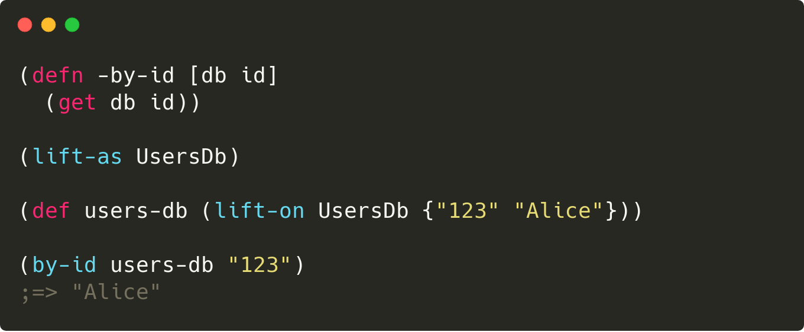

[](https://clojars.org/functionalbytes/lifted)
[](https://cljdoc.org/d/functionalbytes/lifted/CURRENT)
[](https://github.com/aroemers/lifted/actions?query=workflow%3A%22Clojure+CI%22)
[](https://clojars.org/functionalbytes/lifted)


# 🚡 Lifted

A Clojure library for lifting functions into protocols.
It allows an easy way to protocolize a default implementation, which can be useful for testing (mocking) purposes for example.



## Usage

The library offers two macros and a function.

```clj
(require '[lifted.core :refer [lift-as lift-on lifted]])
```

The `lift-as` macro declares a protocol.
Its sole argument is the name of the protocol to declare.
The macro lifts the functions in the current namespace which names are prefixed with the `-` character into the protocol.
The prefix is stripped from the protocol function names.
Only those functions which take at least one argument are lifted.

For example:

```clj
(defn -incr
  "Incrementer function."
  ([this] (-incr this 1))
  ([this n] (+ this n)))

(lift-as Incrementer)
```

The `lift-as` macro above expands to:

```clj
(defprotocol Incrementer
  (incr [this] [this n] "Incrementer function."))
```

The `lift-on` macro defines a protocol implementation.
Its two arguments are the protocol to implement and the object to use as `this`.
The protocol simply forwards the calls to the prefixed functions, passing the `this` object as the first argument.
For example:

```clj
(def i (lift-on Incrementer 5))
```

The `lift-on` macro above expands to:

```clj
(def i
  (let [G__3427 5]
    (reify Incrementer
      (incr [this] (-incr G__3427))
      (incr [this n] (-incr G__3427 n))

      lifted.core/Lifted
      (lifted [_] G__3427)))
```

Now you can use the protocol implementation.

```
(incr i)
;=> 6

(incr i 10)
;=> 15
```

To retrieve the object on which the protocol implementation was lifted on, you can use the `lifted` function.
For example:

```clj
(lifted i)
;=> 5
```

### Closing remarks

#### Varargs

Clojure protocols do not support varargs.
Therefore the lifted function signatures with a vararg are normally stripped from the protocol.
If however one needs varargs, you can pass an option map to `lift-as` as follows:

```clj
(defn -vararg-test [y & ys]
  ...)

(lift-as VarargTest {:expand-vararg-for #{-vararg-test}})
```

This will expand the vararg into concrete arguments, up to a maximum of 20 total arguments.
For example, above `lift-as` form would expand to:

```clj
(defprotocol VarargTest
  (vararg-test [y] [y ys_0] [y ys_0 ys_1] ... [y ys_0 ys_1 ... ys_18]))
```

The rule that a lifted function should at least take one argument still applies.

#### Destructuring

The macros do not support destructuring syntax in the signatures of the to-be lifted functions.
Please do the destructuring inside the function, using a `let` for example.

_That's it. Enjoy!_ 🚀

## License

Copyright © 2020 Functional Bytes

This program and the accompanying materials are made available under the
terms of the Eclipse Public License 2.0 which is available at
http://www.eclipse.org/legal/epl-2.0.

This Source Code may also be made available under the following Secondary
Licenses when the conditions for such availability set forth in the Eclipse
Public License, v. 2.0 are satisfied: GNU General Public License as published by
the Free Software Foundation, either version 2 of the License, or (at your
option) any later version, with the GNU Classpath Exception which is available
at https://www.gnu.org/software/classpath/license.html.
